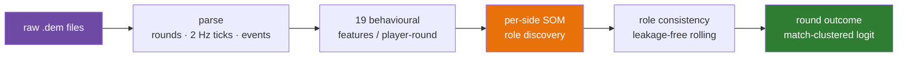
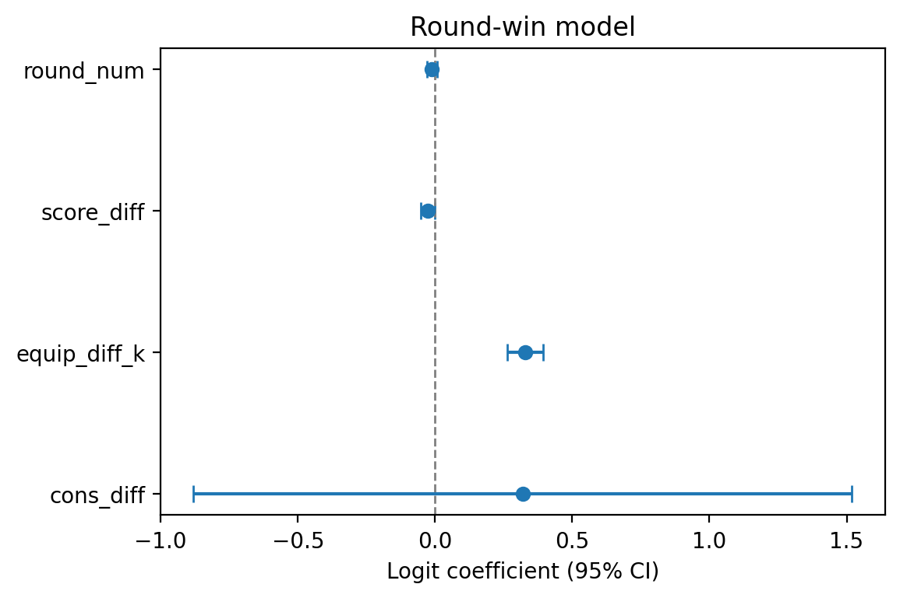
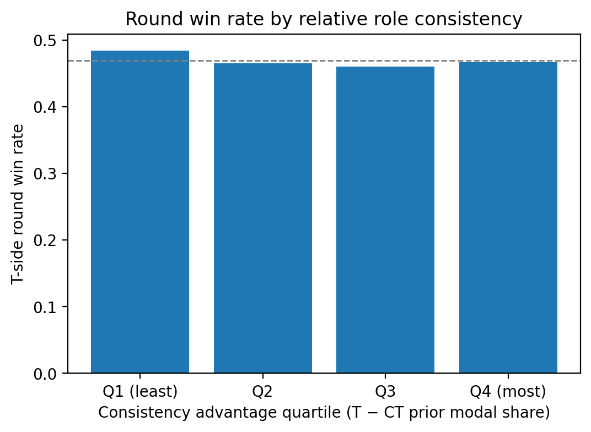
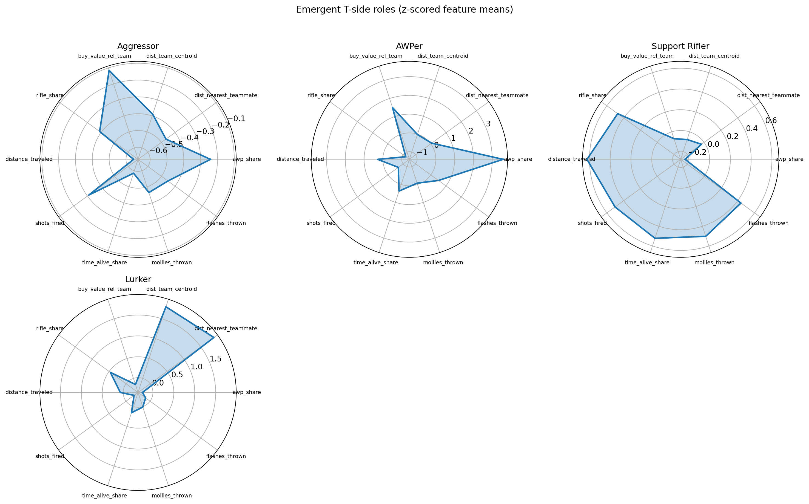
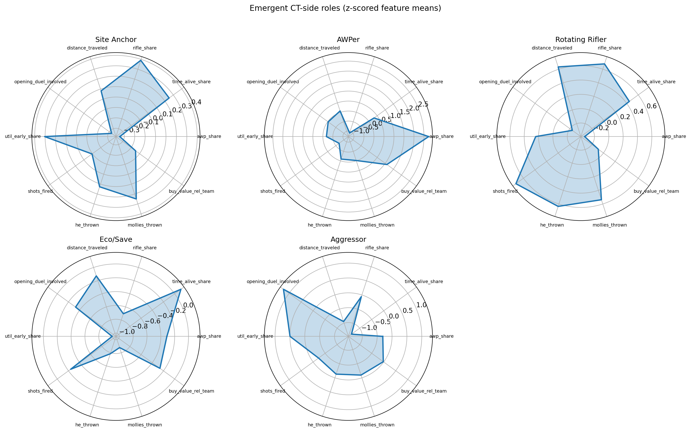
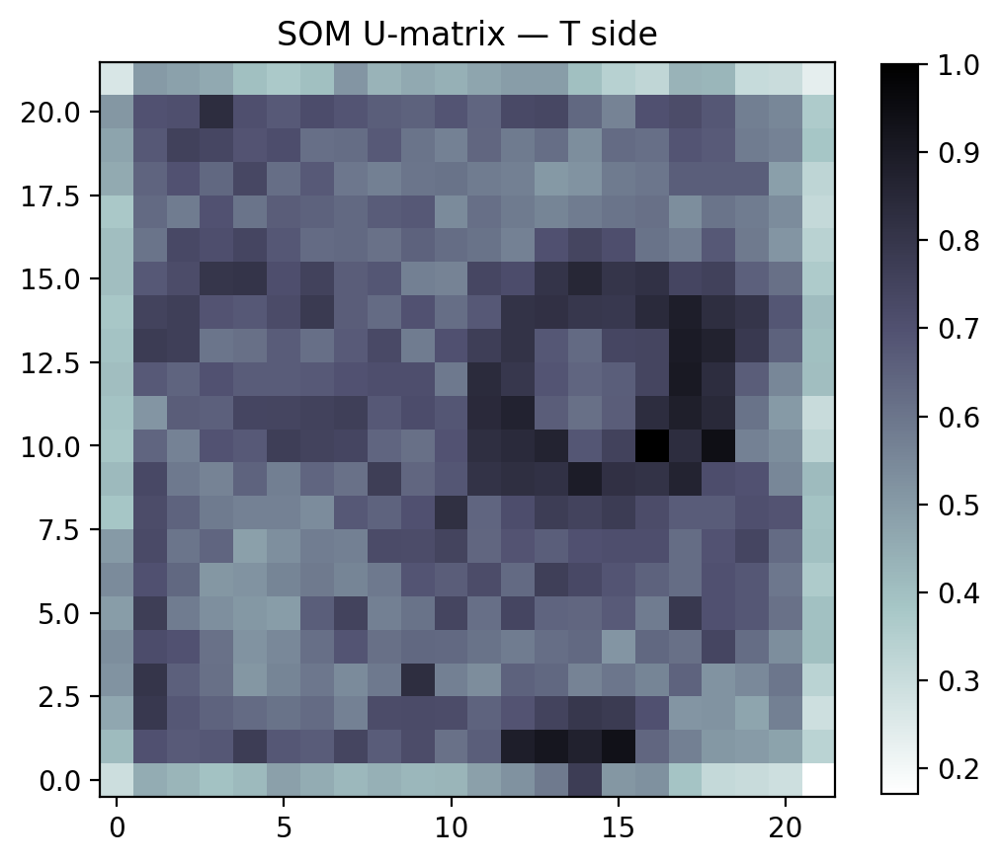
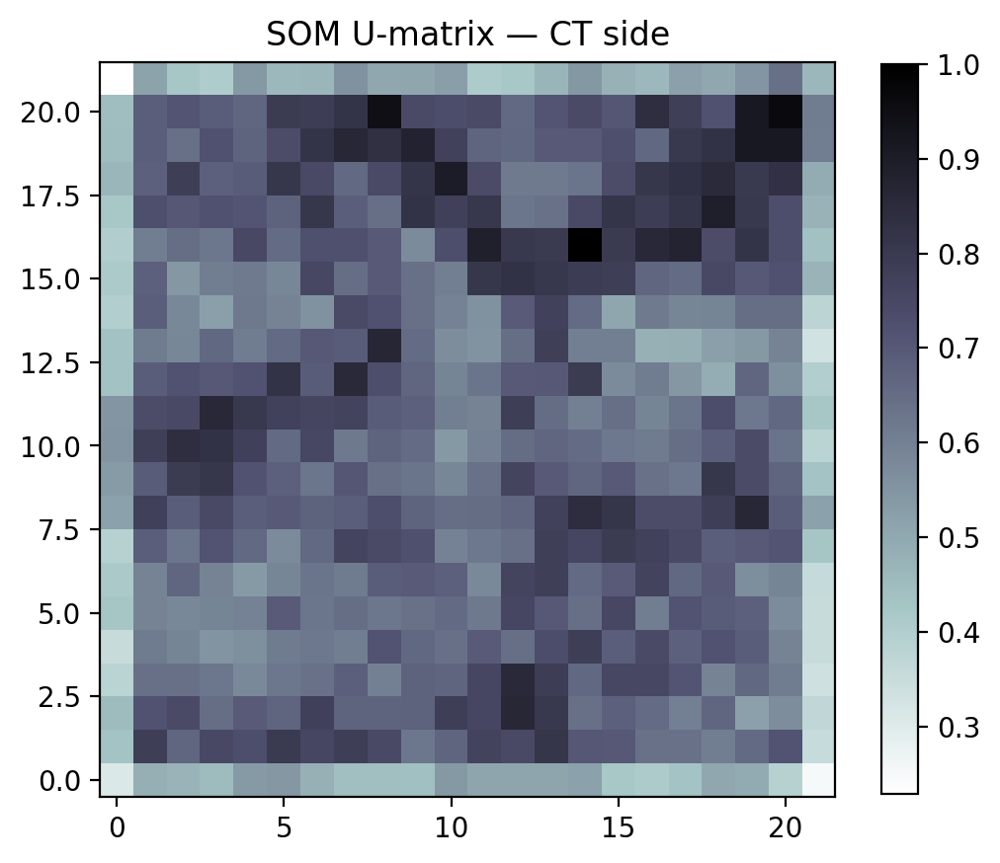
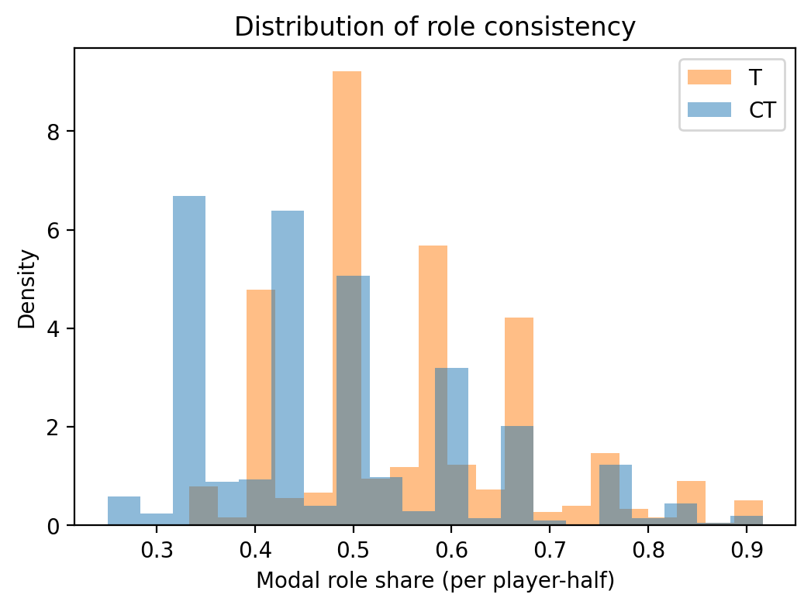
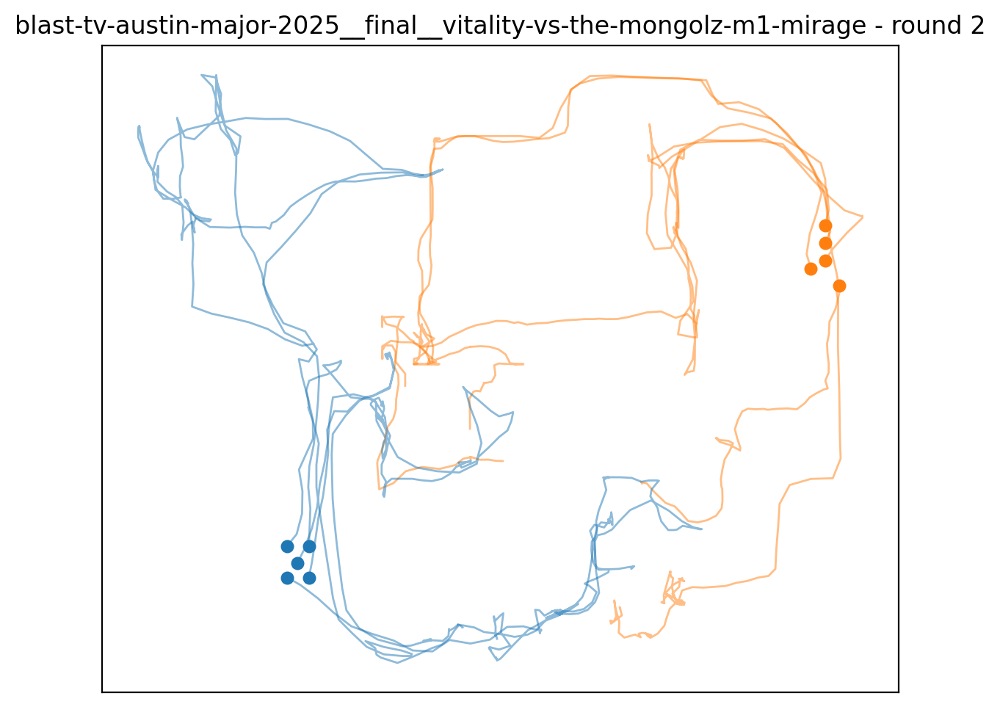

<div align="center">

<h1>CS2 Role Consistency &amp; Round Outcomes</h1>

<p><em>Measuring behavioural player roles in Counter-Strike 2 with Self-Organizing Maps —<br/>and testing whether staying "in role" actually helps you win the round.</em></p>

<p><strong>Bachelor's Thesis Project</strong> · Sachin Kumar (S20240010206) · IIIT Sri City</p>

<p>
<a href="LICENSE"></a>


</p>

</div>

---

An end-to-end research pipeline that

1. **derives behavioural player roles** from professional CS2 demo files using per-side Self-Organizing Maps (following Drachen, Canossa &amp; Yannakakis, *IEEE CIG 2009*),
2. **quantifies each player's role consistency** across a match, and
3. **tests whether prior consistency predicts round outcomes** under a leakage-free, prospective design with match-clustered inference.



## Headline result

> **Consistency and winning travel together within a half** (OLS β = **0.54**, *p* = 0.002) — **but a team's *prior* average consistency does not predict the next round** (logit β = 0.32, 95% CI [−0.88, 1.52]).
>
> The null survives eco-exclusion, taxonomy granularity (*k* ± 1), per-map splits, and a 100-replicate permutation test. The raw association appears to run substantially **winning → consistency**, not the reverse: winning preserves the economy, which preserves the plan, which preserves roles.

<div align="center">


<br/>
<sub><b>Left:</b> round-outcome logit — the positive control (equipment) is strongly significant while prior consistency is a tight null. <b>Right:</b> win rate is flat across prior-consistency quartiles (48.4 → 46.7%).</sub>
</div>

## The role taxonomy

Roles are **discovered, not assumed** — a SOM is trained per side and the codebook is clustered into archetypes, which are then named by hand from their behavioural signatures. `K_BY_SIDE = {T: 4, CT: 5}`, locked for this corpus.

| Side | Roles |
|------|-------|
| **T** | Aggressor · AWPer · Support Rifler · Lurker |
| **CT** | Site Anchor · AWPer · Rotating Rifler · Eco/Save · Aggressor |

<div align="center">


<br/>
<sub>Top-10 discriminative features per role (z-scored vs the side mean). Radars carry the <b>final</b> role names, so they match the report exactly.</sub>
</div>

<details>
<summary><b>More figures</b> — SOM U-matrices, consistency distribution, smoke-test traces</summary>

<div align="center">


<br/>


<br/>
<sub>U-matrices show the trained 22×22 self-organizing maps; the smoke-test traces are the round-1 positional sanity check against the official HLTV scoreline.</sub>
</div>

</details>

## Corpus

| | |
|---|---|
| **Maps** | 76 professional maps |
| **Events** | 10 (2024–2025) — majors, IEM, ESL Pro League |
| **Teams** | 13 |
| **Rounds** | 1,652 |
| **Player-rounds** | 16,520 (8,260 per side) |
| **Determinism** | fixed seed (42) + fixed config reproduce every thesis number |

Raw `.dem` files are HLTV/Valve content and are **not** redistributed — [`manifest.csv`](manifest.csv) is the dataset specification for re-downloading the exact corpus, and [`scripts/extract_dems.ps1`](scripts/extract_dems.ps1) closes the acquisition loop.

## Repository layout

```
cs2-btp/
├── manifest.csv              source of truth: one row per demo + status
├── code/cs2btp/              the Python package (9 modules)
├── notebooks/                7 Colab driver notebooks (run in order)
├── models/                   role profiles & names (persisted taxonomy)
├── analysis/                 consistency tables, regression datasets, QC,
│                             stability, permutation & robustness artifacts
├── figures/                  thesis-ready PNGs (200 dpi)
├── docs/                     the reference documentation set
├── scripts/                  extract_dems.ps1 (dataset acquisition)
├── raw_dems/     (gitignored) input .dem files (event__stage__match naming)
├── parsed/       (gitignored) per-demo parquet (rounds, ticks, events)
└── features/     (gitignored) player-round feature tables (+ role labels)
```

## Quickstart (Google Colab + Drive)

1. Upload `code/cs2btp/` to `My Drive/cs2-btp/code/cs2btp/` and `notebooks/` to `My Drive/cs2-btp/notebooks/`; put demos in `raw_dems/`.
2. Open each notebook in Colab and **run in order** (table below). Every stage is resumable — re-running skips finished work.
3. After replacing any `.py` file in Drive: delete `code/cs2btp/__pycache__` and **Runtime → Disconnect and delete runtime** before re-running (Colab caches imported modules aggressively).

| # | Notebook | Stage | Typical runtime |
|:-:|----------|-------|-----------------|
| 00 | `setup_and_smoke_test` | env check; parse ONE demo; validate vs HLTV | ~5 min |
| 01 | `parse_all_demos` | parse everything in the manifest (resumable) | 1–3 min/demo |
| 02 | `build_features` | 19 behavioural features per player-round (cached) | ~1 min/demo |
| 03 | `discover_roles` | per-side SOMs; **choose k; name roles**; stability | 45–70 min |
| 04 | `consistency_metrics` | modal share / entropy / switch; rolling variant | ~2 min |
| 05 | `outcome_analysis` | round-level logit; descriptives; half-level OLS | ~2 min |
| 06 | `robustness` | no-eco; k ± 1; per-map; permutation; weakest-link | 60–90 min |

> Notebook **03** contains the two human-in-the-loop cells (`K_BY_SIDE`, `FINAL_NAMES`). Both are **locked with the final decisions** for this corpus and safe to Run-all.

## Documentation (`docs/`)

| File | Contents |
|------|----------|
| [`ARCHITECTURE_AND_DATA.md`](docs/ARCHITECTURE_AND_DATA.md) | pipeline architecture, data flow, every file schema |
| [`MODULE_REFERENCE.md`](docs/MODULE_REFERENCE.md) | API reference for all 9 modules + full config reference |
| [`NOTEBOOK_GUIDE.md`](docs/NOTEBOOK_GUIDE.md) | per-notebook inputs/outputs, editable cells, checks |
| [`DECISIONS_AND_RESULTS.md`](docs/DECISIONS_AND_RESULTS.md) | the complete decision log + results summary |
| [`REPRODUCTION_AND_TROUBLESHOOTING.md`](docs/REPRODUCTION_AND_TROUBLESHOOTING.md) | exact reproduction steps, environment, known issues |

Start with [`PROJECT_CONTEXT.md`](PROJECT_CONTEXT.md) for the self-contained ground-truth overview.

## Requirements

Google Colab (CPU is sufficient) with Drive mounted. Installed by the bootstrap cell: `demoparser2` (pinned **0.41.3**), `minisom`. Pre-installed on Colab: `pandas`, `numpy`, `scipy`, `scikit-learn`, `statsmodels`, `joblib`, `matplotlib`, `pyarrow`. See [`requirements.txt`](requirements.txt).

## Methodological lineage

Role discovery replicates **Drachen, Canossa &amp; Yannakakis, "Player Modeling using Self-Organization in Tomb Raider: Underworld" (IEEE CIG 2009)**: behavioural telemetry → emergent SOM → cluster the map → manual inspection and naming → stability analysis. This is **distinct** from Drachen, Sifa, Bauckhage &amp; Thurau, *"Guns, Swords and Data"* (IEEE CIG **2012**, large-scale behavioural clustering) — cite both, correctly attributed.

## Citation

If you use this pipeline or its findings, please cite it via the repository's [`CITATION.cff`](CITATION.cff) (GitHub → *Cite this repository*):

> Kumar, S. (2026). *Player Role Consistency and Round Outcomes in Counter-Strike 2.* Bachelor's Thesis, Indian Institute of Information Technology, Sri City.

## License

Released under the [MIT License](LICENSE) for the pipeline code and notebooks. Derived statistical artifacts (features, models, analysis tables) are provided for research reproducibility only; source `.dem` files are HLTV/Valve content and are not distributed.
